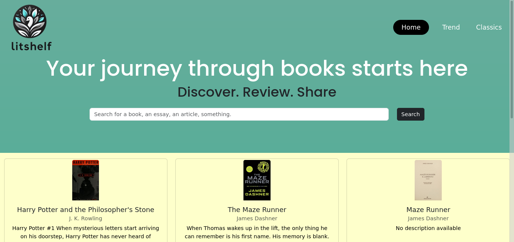
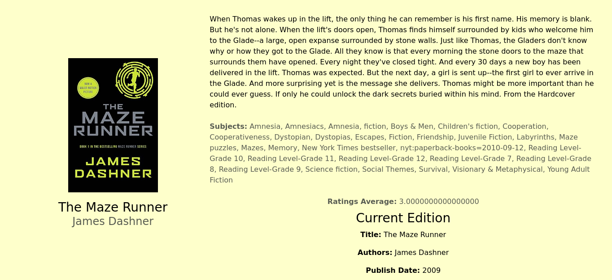
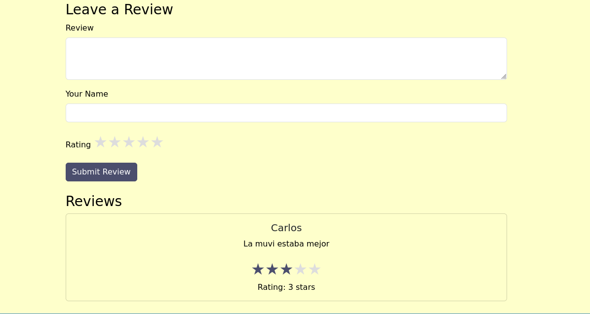

# LitShelf

LitShelf is a web application that allows users to explore, review, and discover books. The platform provides information about book titles, authors, subjects, and reviews while integrating seamlessly with external book data APIs.

## Features

- **Search and Filter Books**: Search for books by title, author, or subject.
- **Detailed Book Information**: View book descriptions, ratings, and metadata.
- **User Reviews**: Leave and read reviews for books.
- **Responsive Design**: Optimized for desktop and mobile devices using Bootstrap and custom CSS.

## Tech Stack

- **Frontend**: HTML, EJS, Bootstrap, CSS
- **Backend**: Node.js, Express.js
- **Database**: PostgreSQL
- **External API**: Open Library API for book data

## ScreenShots








## Installation

1. Clone the repository:
   ```bash
   git clone https://github.com/yourusername/litshelf.git
   cd litshelf

2. Install dependencies:
    ```bash
    npm install
    ```

3. Set up environment variables:
    Create a `.env` file in the root directory and add the following:
    ```
    DATABASE_URL=your_database_url
    API_KEY=your_api_key
    ```

4. Run the application:
    ```bash
    npm start
    ```

5. Open your browser and navigate to `http://localhost:3000` to see the application in action.
